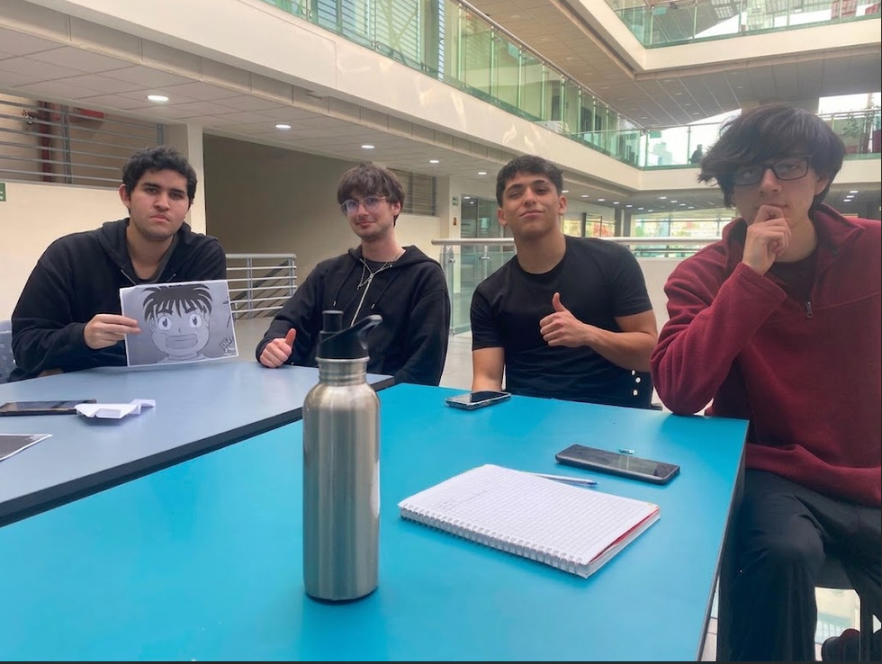

# Sistema de Gestión de Residuos Reciclables

## Capstone Intermedio 2026

**Equipo:** Revirt  
**Desafío:** Desafío 04: Gestión y medición de residuos reciclables del Hub  
**Contraparte:** Municipalidad de Providencia / Hub Providencia  
**Estado actual:** En desarrollo

## Descripción

El equipo busca diseñar un sistema y una metodología que permita cuantificar y monitorear la gestión de residuos reciclables en el edificio del Hub Providencia. Actualmente, el edificio genera distintos tipos de residuos pero carece de un sistema consolidado de registro y medición, lo que dificulta la toma de decisiones ambientales. Nuestro proyecto busca transformar este problema físico en datos medibles a través de la tecnología.

## Equipo

| Integrante | Carrera o especialidad | Rol inicial | Usuario de GitHub |
|---|---|---|---|
| Matías Sandoval | Ingeniería Civil en Computación e Informática | Lider | Matias Sandoval |
| Javier Saavedra | Ingeniería Civil en Computación e Informática | Investigación | [@usuario_javier] |
| Sebastian Sepulveda | Ingeniería Civil en Computación e Informática | [Rol de Sebastian] | [@usuario_sebastian] |
| Franco Rodriguez | [Carrera de Franco] | [Rol de Franco] | [@usuario_franco] |

## Valores del equipo

- **Comunicación:** Mantener una comunicación abierta para poder coordinar las distintas actividades de manera efectiva.
- **Proactividad:** Mantener la iniciativa para resolver problemas técnicos o de gestión antes de que se vuelvan bloqueos.
- **Compromiso:** Asumir las tareas como propias y poner todo el empeño en sacar el trabajo adelante.

## Normas de funcionamiento

1. La comunicación rápida será por Discord o WhatsApp, y tendremos una reunión de sincronización.
2. El tiempo de todos es valioso. Si alguien va a llegar tarde o no puede asistir a una reunión, debe avisar con al menos 2 horas de anticipación.
3. Discutiremos juntos claramente las tareas y las dividiremos, después usaremos un tablero para revisar qué está pendiente, en proceso o terminado.
4. **Cómo resolveremos desacuerdos:** Las decisiones se tomarán por consenso y debate técnico. Si no hay acuerdo unánime, se someterá a votación por mayoría simple. En caso de conflicto mayor, lo conversaremos de forma transparente y, si persiste, hablaremos con el docente.
5. **Cómo registraremos las decisiones:** Cada integrante es responsable de subir sus propios avances a GitHub realizando un commit con un mensaje descriptivo. Evitaremos subir versiones a medias el mismo día de la entrega.

## Desafío inicial

Entendemos este desafío como la necesidad de diseñar un sistema y una metodología que permita cuantificar y monitorear la gestión de residuos reciclables en el Hub Providencia. 
* **Lo que sabemos:** Carecen de un sistema consolidado para registrar, medir y analizar cuánto generan y recuperan. Los usuarios principales son el equipo de gestión, laboratorios y visitantes.
* **Lo que todavía no sabemos:** Los tipos de residuos específicos que más se generan (plástico, papel, lata), sus volúmenes, la ubicación de los acopios y el flujo de personas hacia ellos.
* **Supuestos que debemos comprobar:** Asumimos que existe un espacio físico adecuado y seguro para instalar nuestro prototipo sin interrumpir el paso, y que la administración conoce la frecuencia de retiro del reciclaje actual.

## Objetivo SMART del equipo

Desarrollar un prototipo funcional de registro y seguimiento de residuos reciclables creando un sistema de medición y un panel de indicadores de generación utilizando tecnologías de bajo costo y bases de datos estructuradas para ser testeado en un espacio piloto del Hub Providencia antes de la feria final del semestre.

## Compromisos individuales

| Integrante | Compromiso SMART |
|---|---|
| Matías Sandoval | Crear repositorio inicial en GitHub con la estructura de carpetas y README para el 27-08-2026. |
| Javier Saavedra | Buscar 2 ejemplos o ideas de cómo se mide el reciclaje en otros lugares para inspirar nuestro prototipo para el 27-08-2026. |
| Sebastian Sepulveda | [Compromiso de Sebastian] |
| Franco Rodriguez | [Compromiso de Franco] |

## Usuarios y contexto

Los principales usuarios o beneficiarios de este proyecto son el equipo de gestión del Hub, los distintos laboratorios y las personas que visitan y utilizan el edificio diariamente. El problema ocurre dentro de las instalaciones del Hub Providencia, donde existe la necesidad latente de conocer métricas reales sobre la basura y el reciclaje que generan los visitantes y trabajadores.

## Plan inicial

| Actividad | Responsable(s) | Fecha | Estado |
|---|---|---|---|
| Crear repositorio en GitHub con estructura inicial y README | Matías Sandoval | 27-08-2026 | Terminado |
| Investigar proyectos similares o ejemplos de prototipos de medición de reciclaje | Javier Saavedra | 27-08-2026 | Pendiente |
| [Actividad de Sebastian/Franco] | [Nombre] | [dd-mm-aaaa] | Pendiente |

## Índice de la bitácora

- [S01 - Identidad del equipo y desafío](bitacora/S01.md)
- [S02 - Levantamiento inicial](bitacora/S02.md)
- [S03 - Empatizar](bitacora/S03.md)

## Evidencias principales

- [Aún en etapa de definición]

## Decisiones relevantes

| Fecha | Decisión | Evidencia o criterio utilizado |
|---|---|---|
| 25-08-2026 | Elección del Desafío 04 | Interés del equipo en desarrollar soluciones de sostenibilidad utilizando hardware y datos. |

## Próximo hito

Definir la idea general del proyecto y coordinar una visita al Hub Providencia para observar directamente los problemas de residuos en terreno.

## Uso y licencia

Por definir con el equipo docente y la contraparte. No reutilizar ni publicar información reservada sin autorización.
