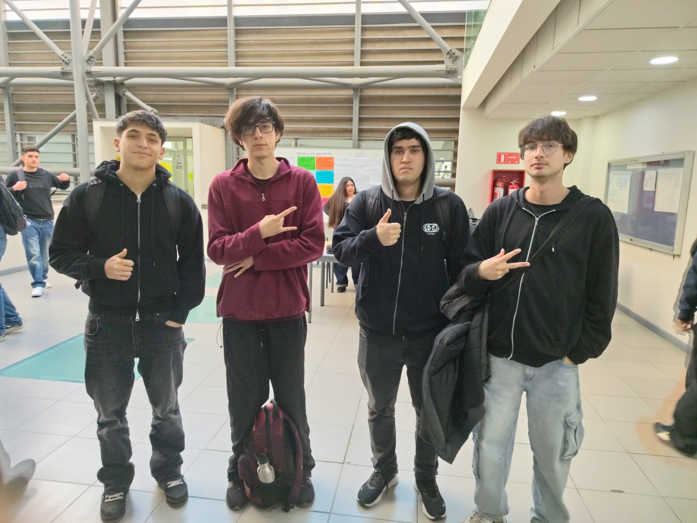
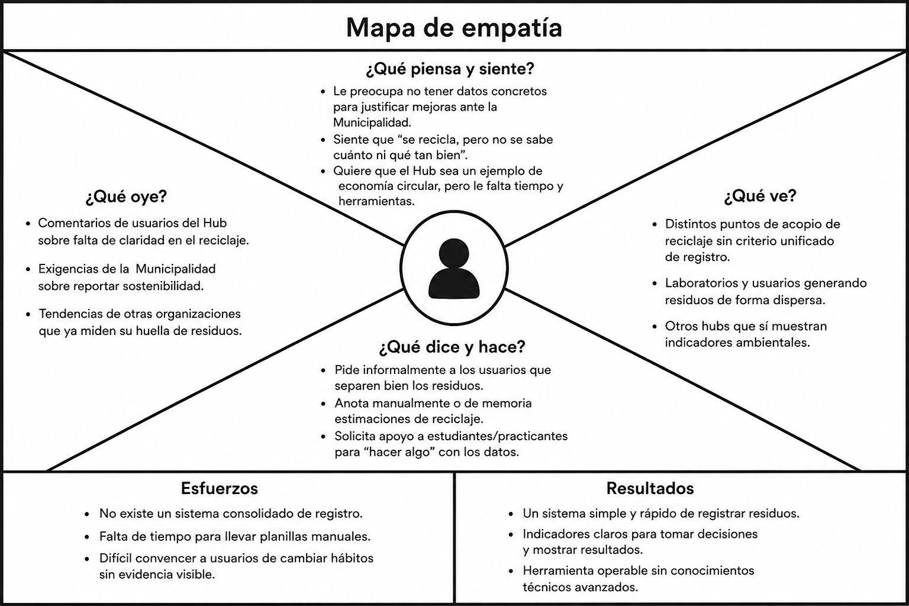
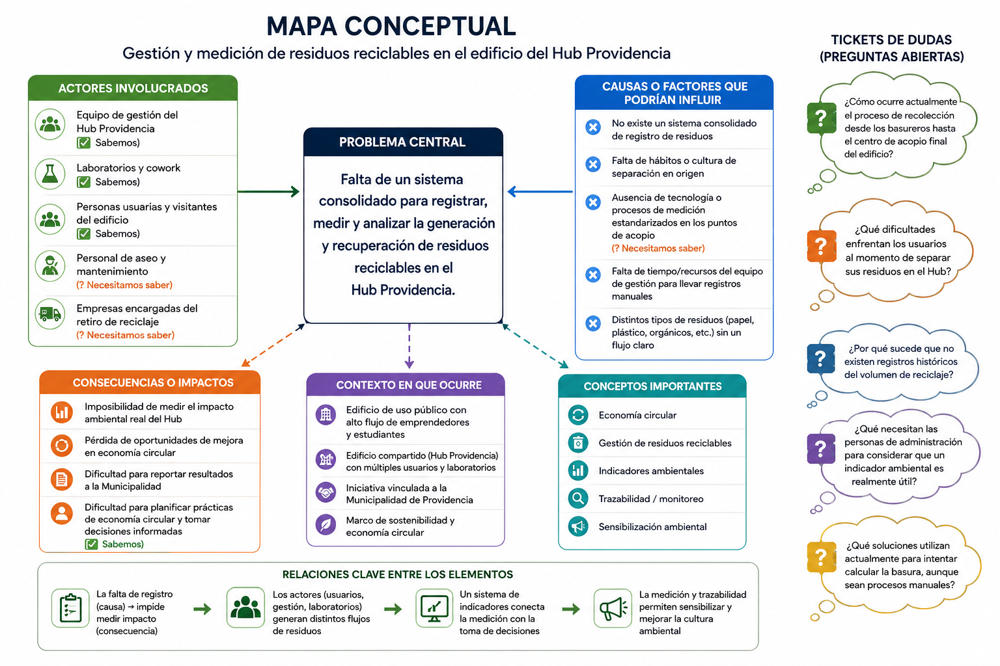

# S02 - Comprensión del problema y Comunicación Oral.

**Fecha:** 02-09-2026 
**Participantes:** Matías Sandoval, Javier Saavedra, Sebastian Sepulveda, Franco Rodriguez
**Responsable del registro:** Matías Sandoval

## Objetivo

Comprender profundamente el problema de la gestión de residuos en el Hub Providencia desde la perspectiva de los usuarios y practicar técnicas de comunicación oral efectiva para la próxima evaluación.

## Actividades realizadas

1. Elaboración del Mapa Conceptual del desafío, identificando actores, causas, consecuencias y conceptos clave sobre el problema central de la basura.
2. Creación del Mapa de Empatía centrado en el equipo de gestión del Hub Providencia para entender sus dolores y necesidades.
3. Práctica de presentación oral mediante el ejercicio "La charla del absurdo", aplicando técnicas de lenguaje corporal y estructura de discurso en un tiempo límite de 2 minutos

## Evidencias

 

## Resultados

1. Logramos identificar 3 supuestos importantes que debemos validar directamente con el Hub Providencia, junto con 5 preguntas abiertas para futuras entrevistas de levantamiento.
2. Realizamos la presentación oral rápida implementando la estructura sugerida: 30 segundos de introducción, 1 minuto de desarrollo y 30 segundos de conclusión

## Decisiones y justificación

| Decisión | Evidencia o criterio | Consecuencia para el proyecto |
|---|---|---|
| Centrar el Mapa de Empatía en el equipo de gestión del Hub. | Son ellos quienes sufren la falta de datos y deben reportar resultados de sostenibilidad a la Municipalidad. | l diseño del prototipo y del dashboard deberá enfocarse en facilitarles métricas rápidas y automatizadas. |
| Priorizar imágenes sobre texto para las presentaciones. | La recomendación de la clase es usar un 70% de imagen y 30% de texto para no sobresaturar las diapositivas | Nuestra presentación del Hito 1 será visual, obligándonos a dominar el tema sin leer. |

## Errores, dificultades o riesgos

- Qué no funcionó: Manejar el pánico escénico y los nervios al hablar rápido, lo que provocó el uso de muletillas
- Por qué creemos que ocurrió: Falta de ensayo (Role Playing) y presión por el tiempo limitado de la actividad
- Qué haremos para comprobarlo o corregirlo: Ensayaremos nuestro pitch del Hito 1 varias veces antes de la clase para dominar la información y reducir la ansiedad

## Aprendizajes

El equipo ahora entiende que un buen proyecto de innovación no parte de la tecnología, sino de un profundo entendimiento de las personas afectadas por el problema.

## Tareas y responsables

| Tarea | Responsable(s) | Fecha límite | Estado |
|---|---|---|---|
| Preparar y ensayar el Pitch del problema (no la solución) para el Hito 1 | Todos | 09-09-2026 | Finalizado |
| Elaborar reporte de 1 carilla con la ficha de desafío actualizada | Javier y Franco | 09-09-2026 | Finalizado |
| Subir mapas y actualizar bitácora S02 en GitHub | Matías Sandoval | 09-09-2026 | Finalizado |

## Próximo paso

Nuestra siguiente acción es realizar la evaluación del Hito 1, donde debemos presentar oralmente el problema, entregar la ficha del desafío con información propia y tener nuestra bitácora al día en GitHub. La evidencia de éxito será la calificación y retroalimentación obtenida de los docentes.

## Fuentes consultadas

- [Autor u organización, título y enlace]
