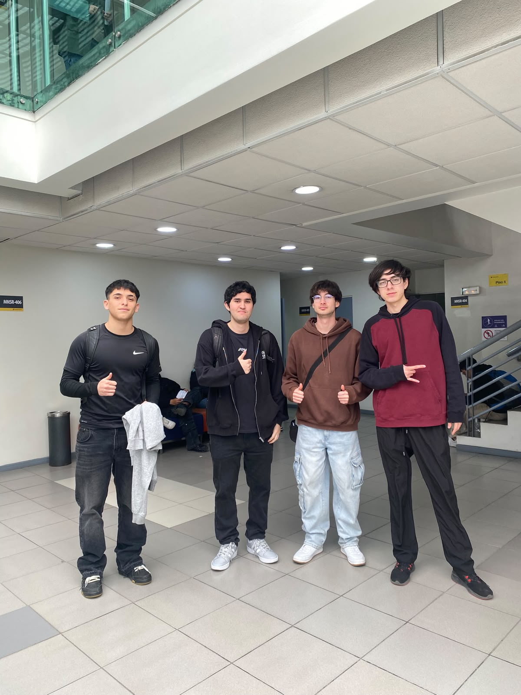

# S03 - Hito 1: Presentación del problema y Ficha Diagnóstica

**Fecha:** 09-09-2026  
**Participantes:** Matías Sandoval, Javier Saavedra, Sebastian Sepulveda, Franco Rodriguez  
**Responsable del registro:** [Nombre del responsable]

## Objetivo
Presentar oralmente el problema del desafío (no la solución) en la evaluación del Hito 1, entregar la Ficha Diagnóstica con información propia y demostrar, mediante la bitácora en GitHub, la trazabilidad del proceso de descubrimiento del equipo.

## Actividades realizadas
1. Presentación oral del problema en formato pitch de 2 minutos, con la estructura trabajada en S02: 30 segundos de introducción (gancho y contexto), 1 minuto de desarrollo (problema y bitácora) y 30 segundos de conclusión (próximos pasos).
2. Entrega de la Ficha Diagnóstica del desafío, que define como ámbito de trabajo la gestión, trazabilidad y visibilidad de datos de residuos en el Hub Providencia.
3. Reencuadre explícito del problema frente a docentes y compañeros: lo que parece un problema logístico de recolección es, en el fondo, una crisis de información que afecta al equipo de gestión del Hub.
4. Presentación de la bitácora en GitHub como herramienta de trazabilidad: justificación de decisiones, registro de errores y riesgos (incluido el riesgo de nervios identificado en S02).
5. Síntesis de 3 supuestos críticos, extraídos del Mapa Conceptual y del Mapa de Empatía, para validar en terreno con el equipo del Hub.

## Evidencias

- [Ficha Diagnóstica del desafío (documento completo)](../entregas/Ficha_Diagnostica_Revirt.docx)
  

## Resultados
- Se presentó el problema dentro del tiempo y con la estructura 30/60/30 definida en S02, sin presentar soluciones tecnológicas.
- El problema quedó formulado en torno a las personas: el equipo de gestión del Hub vive la presión de reportar métricas de sostenibilidad a la Municipalidad sin contar con información rápida ni confiable sobre sus residuos.
- La Ficha Diagnóstica consolidó el ámbito del desafío: gestión, trazabilidad y visibilidad de datos de residuos.
- Se definieron 3 supuestos críticos a validar en terreno:
  1. El equipo de gestión dedica un tiempo excesivo (estimado en más de 5 horas semanales) a armar los reportes de residuos a partir de datos dispersos.
  2. La Municipalidad de Providencia exige formatos y métricas estandarizadas que el Hub, en su condición actual, no puede completar de forma confiable.
  3. La falta de retroalimentación sobre el impacto de sus residuos es una de las razones por las que los usuarios del Hub no segregan correctamente.
- La Ficha Diagnóstica incorporó una matriz interdisciplinaria del problema en seis dimensiones (humana, de proceso, datos, tecnología, organización e impacto) y delimitó explícitamente el alcance: qué abordará el proyecto, qué no y sus restricciones operativas, normativas, técnicas y temporales.
- Se definieron 4 preguntas clave a averiguar en terreno, entre ellas el procedimiento y la herramienta exacta que hoy se usa para registrar residuos, y los KPI y formatos que exige la Municipalidad.
- Retroalimentación docente recibida: [completar con los comentarios y la nota obtenida].

## Decisiones y justificación

| Decisión | Evidencia o criterio | Consecuencia para el proyecto |
|---|---|---|
| Presentar el problema como una crisis de información y no como un problema logístico de basura | El Mapa de Empatía (S02) mostró que el dolor del equipo de gestión es no tener datos para reportar, no el retiro físico de residuos | La investigación siguiente se centrará en cómo se captura, registra y reporta hoy la información |
| No presentar ninguna solución tecnológica en el Hito 1 | Requisito del Hito 1 (presentar el problema, no la solución) y aprendizaje de S02: la innovación parte de las personas, no de la tecnología | La ideación queda postergada hasta validar el problema con usuarios reales |
| Mostrar la bitácora como evidencia central del proceso | La bitácora registra decisiones, errores y riesgos, lo que demuestra trazabilidad del aprendizaje | El equipo se compromete a mantener la bitácora al día cada semana |
| Validar los 3 supuestos directamente con el equipo del Hub | Hasta ahora los supuestos provienen de mapas construidos sin contacto directo con usuarios | Se debe coordinar una visita y entrevistas en terreno como próxima prioridad |
| Separar en la Ficha la evidencia levantada de la interpretación del equipo | Criterio metodológico: distinguir hechos verificables de lecturas propias evita confundir hipótesis con datos | Cada afirmación nueva deberá indicar su fuente (enunciado del desafío, entrevista, observación) |
| Excluir del alcance la recolección física de residuos y cualquier solución tecnológica específica | El problema validado hasta ahora es informativo, no logístico, y aún no se ha validado en profundidad con usuarios | El trabajo de las próximas semanas se limita a diagnosticar el flujo de captura, consolidación y reporte de datos |

## Errores, dificultades o riesgos
- **Qué no funcionó:** Al revisar la documentación para el Hito 1 detectamos incoherencias: el README, el objetivo SMART y el Supuesto 1 de S01 hablan de un prototipo, hardware o panel de indicadores, mientras que el discurso actual del equipo es que aún no corresponde proponer soluciones.
- **Por qué creemos que ocurrió:** En S01 partimos desde nuestro perfil técnico e imaginamos la solución antes de comprender el problema (sesgo de solución), y no actualizamos esos textos cuando cambió nuestro enfoque.
- **Qué haremos para comprobarlo o corregirlo:** Reformular el README, el objetivo SMART y los supuestos de S01 en términos del problema de información del equipo de gestión.

- **Riesgo identificado:** Los 3 supuestos críticos aún no han sido contrastados con usuarios reales, por lo que el problema podría estar mal dimensionado.
- **Mitigación:** Entrevistar al equipo de administración del Hub y observar en terreno antes de avanzar a la etapa de definición.

## Aprendizajes
- La innovación no parte de la tecnología, sino de un profundo entendimiento de las personas afectadas por el problema.
- Reencuadrar el problema (de logística a información) cambia por completo a quién debemos escuchar y qué evidencia debemos buscar.
- Ensayar el pitch con una estructura definida (30/60/30) ayudó a ordenar el mensaje y a abordar el riesgo de nervios identificado en S02.
- La bitácora no es un resumen de tareas, sino una herramienta de trazabilidad: solo vale si se mantiene coherente y actualizada.

## Tareas y responsables

| Tarea | Responsable(s) | Fecha límite | Estado |
|---|---|---|---|
| Coordinar visita y entrevistas con el equipo de administración del Hub Providencia | Javier Saavedra | 16-09-2026 | Pendiente |
| Diseñar pauta de entrevista para validar los 3 supuestos críticos y responder las 4 preguntas de la Ficha | Sebastian Sepulveda | 16-09-2026 | Pendiente |
| Reformular README, objetivo SMART y supuestos de S01 sin adelantar soluciones | Matías Sandoval | 16-09-2026 | Pendiente |
| Completar las fuentes consultadas de S02 | Franco Rodriguez | 16-09-2026 | Pendiente |
| Subir evidencias del Hito 1 a `/imagenes/S03/` y la Ficha Diagnóstica a `/docs/` | Todos | 16-09-2026 | Pendiente |

## Próximo paso
Realizar la visita al Hub Providencia y entrevistar al equipo de administración para validar o refutar los 3 supuestos críticos, documentando cómo se registra hoy la información de residuos.

## Fuentes consultadas
- Material de clase Capstone Intermedio 2026 – Universidad Mayor: instrucciones de la evaluación del Hito 1 y técnicas de comunicación oral.
- Equipo Revirt (2026). Ficha Diagnóstica del Desafío – Proyecto Revirt.
- Hasso Plattner Institute of Design at Stanford (d.school). *An Introduction to Design Thinking: Process Guide*.
- Design Council (UK). *Framework for Innovation: the Double Diamond*.
